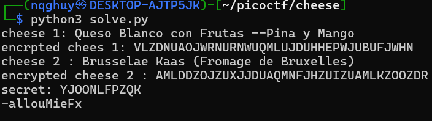

# 🧀 Crack Guess My Cheese 2 🧀  

## 🔍 Phân tích  
- **Cheese list** có thể lấy từ *Guess My Cheese 2*.  
- **Cơ chế mã hóa**: Mỗi chữ cái được ánh xạ sang một chữ cái khác thông qua một hàm hash cố định.  

## 🛠 Cách giải  
1. Lần lượt mã hóa hai loại **cheese** từ danh sách và thu thập giá trị hash của chúng.  
2. Nhập hai loại cheese và hai giá trị hash để **tạo bảng ánh xạ (hash table)**.  
3. Nhập **secret** để in ra mật khẩu trước khi hash.  
4. Tìm kiếm trong **cheese list** để xác định mật khẩu ban đầu.  


## Ưu điểm
- Đơn giản
## ⚠ Nhược điểm  
- Cách làm này có thể hơi chậm.  
- Chưa được tự động hóa hoàn toàn.  
- Tuy nhiên, vẫn giúp tìm được **flag** thành công.  

## 🛠 Cách giải 2
1. Nhập 1 cheese, thu được 1 hash
2. Tìm giá trị a, b sao cho C = (a * p + b) mod 26
```code
def find_ab(s, s_encrypted):
    for a in range(100):
        for b in range(100):
            found = True
            for  i in range (len(s)):
                if s[i] not in string.ascii_lowercase:
                    continue
                p = ord(s[i]) - ord('a')
                c = ord(s_encrypted[i]) - ord('a')
                if (a * p + b) % 26 != c:
                    found = False
            if found == True:
                return a, b
    return None
```
3. Mã hóa ngược secret: P = a^(-1) * (C - b), trong đó a^-1 là nghịch đảo module mode 26
## 🎯 Flag  
``` picoCTF{ChEeSyda811b6e} ```