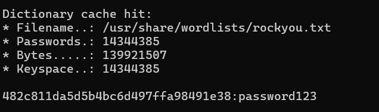

## 🔍 Xác định kiểu hash và crack bằng Hashcat

### 🔹 Bước 1: Sử dụng `hash-identifier` để xác định loại hash
```bash
hash-identifier
```
### 🔹 Bước 2: Sử dụng `hashcat` với option wordlist để tìm mật khẩu
```bash
hashcat -a 0 -m 0 example.hash /usr/share/wordlists/rockyou.txt
```


Tiếp tục thực hiện với các mật khẩu tiếp theo

**Flag: picoCTF{UseStr0nG_h@shEs_&PaSswDs!_dcd6135e}**